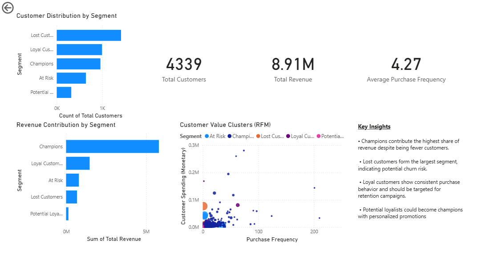

# 📊 Customer Segmentation Using RFM Analysis

## 🚀 Overview

This project performs **customer segmentation using RFM (Recency, Frequency, Monetary) analysis** on an e-commerce retail dataset.

The objective is to identify **high-value customers, churn risks, and potential loyal customers** to support data-driven marketing strategies.

An interactive **Power BI dashboard** was built to visualize customer segments and revenue contribution.

---

# 💼 Business Problem

Businesses often struggle to answer questions like:

- Who are our most valuable customers?
- Which customers are likely to churn?
- Which customers should be targeted for promotions?

Without segmentation, marketing campaigns are often **inefficient and costly**.

This project helps organizations:

- Identify **high-value customers**
- Detect **customers at risk of churn**
- Improve **customer retention strategies**
- Optimize **marketing campaigns**

---

# 🎯 Objectives

The main objectives of this project are:

- Analyze customer purchase behavior
- Calculate **Recency, Frequency, and Monetary (RFM) metrics**
- Segment customers based on purchasing patterns
- Build an **interactive Power BI dashboard**
- Provide **actionable business insights**

---

# 🛠️ Tech Stack

- Python (Pandas, NumPy)
- Jupyter Notebook
- Power BI
- Git & GitHub

---

# 📊 Dataset

The project uses the **Online Retail dataset**, which contains transactional data from an e-commerce store.

Dataset size:

**500K+ retail transactions**

Key fields include:

- InvoiceNo
- CustomerID
- InvoiceDate
- Quantity
- UnitPrice
- Country

These fields enable analysis of **customer purchasing behavior and revenue contribution**.

---

# 📂 Project Structure
rfm-customer-segmentation/

│

├── data/
│ └── online_retail.csv

├── notebooks/
│ └── rfm_analysis.ipynb

├── dashboard/
│ └── rfm_dashboard.pbix

├── outputs/
│ └── rfm_customer_segments.csv

├── images/
│ └── dashboard_preview.png

└── README.md

---

# 📊 Dashboard

An interactive **Power BI dashboard** was developed to analyze customer segments and revenue patterns.

Dashboard highlights:

- Customer distribution by segment
- Revenue contribution by segment
- Total customers and revenue KPIs
- RFM scatter plot showing customer behavior
- Key business insights for marketing teams

---

# 🔍 Key Features

## 📊 Data Cleaning

- Removed cancelled orders
- Removed negative quantities (returns)
- Handled missing Customer IDs

---

## 🧮 Feature Engineering

Created a new feature:
Revenue = Quantity × UnitPrice

Then calculated **RFM metrics**.

---

## 🧮 RFM Metrics

### Recency
Number of days since the customer's last purchase.

### Frequency
Number of purchases made by the customer.

### Monetary
Total amount spent by the customer.

---

## 🧩 Customer Segmentation

Customers were segmented into the following groups:

- Champions
- Loyal Customers
- Potential Loyalists
- At Risk
- Lost Customers

These segments help businesses understand **customer value and engagement levels**.

---

# 📌 Key Insights

- Total revenue exceeded **£8.9M across 4,339 customers**.
- **Champions contribute the highest revenue**, despite being fewer customers.
- **Lost Customers form the largest segment**, indicating potential churn risk.
- **Loyal Customers demonstrate consistent purchasing behavior**.
- **Potential Loyalists can be converted into Champions through targeted promotions**.

---

# 📊 Business Impact

This segmentation helps organizations:

- Identify **high-value customers**
- Reduce **customer churn**
- Personalize **marketing campaigns**
- Improve **customer lifetime value**
- Allocate **marketing budgets more effectively**

---

# 💡 Learnings

This project helped develop skills in:

- Data cleaning and preprocessing
- Feature engineering
- Customer segmentation techniques
- Business analytics
- Data visualization with Power BI
- Communicating insights through dashboards

---

# 👨‍💻 Author

Ayush Yadav
